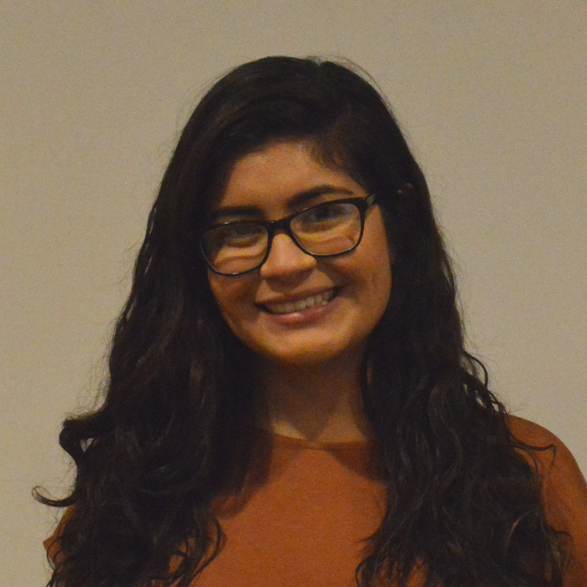

```{r, out.width = '20%', echo = FALSE}
library(knitr)

```


I am a young professional interested in changing healthcare using data science. 


I graduated from the [University of Illinois](https://stat.illinois.edu/) with a Bachelor's degree in statistics and a minor in informatics in 2019. Currently, I am pursuing a Master's degree in biostatistics and data science at [Cornell University](https://gradschool.weill.cornell.edu/programs/healthcare-policy-research). I expect to graduate summer 2020. 

My resume is available [here](resume.pdf) 
